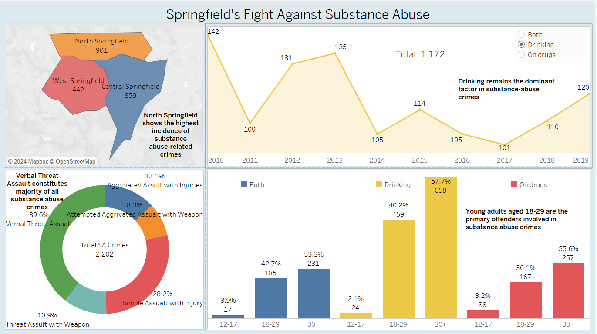

# Tableau Assignment: Substance Abuse Crime Dashboard

This repository contains a Tableau dashboard and related files created as part of a university assignment. The project focuses on analyzing substance abuse-related crimes in different areas and providing actionable insights for three stakeholders: Mayor Jones, Chief Odinson, and Sergeant Rogers.

---

## 📊 Key Visualizations
### Dashboard Overview
Below are the key visualizations included in this project:

---

## 🚀 Features
- Interactive dashboard created using Tableau.
- Focuses on substance abuse-related crimes across various classifications.
- Provides insights for three stakeholders:
  - **Mayor Jones**: Focus on city-wide policy changes.
  - **Chief Odinson**: Target specific demographic groups.
  - **Sergeant Rogers**: Improve law enforcement efficiency.

---

## 🎯 Insights
1. **Substance Abuse Crime Trends**: 
   - Comparative analysis of crimes across regions and demographics.
   - Focus on predictive policing and community safety.

2. **Crime Classifications**:
   - Breakdown of crime types (e.g., aggravated assault, simple assault).

---

## 📌 Stakeholder Recommendations
### For Mayor Jones:
- Consult with community leaders to address substance abuse trends.
- Implement socioeconomic support programs in high-risk areas.

### For Chief Odinson:
- Target interventions for young adults based on demographic trends.
- Expand awareness campaigns to educate the public on substance abuse risks.

### For Sergeant Rogers:
- Strengthen police response strategies based on local crime classifications.
- Advocate for community engagement in crime reporting.

---

## 🖥️ Files in This Repository
- `assignment.twbx`: Tableau Packaged Workbook.
- `Dashboard1.png`, `Dashboard2.png`: Images of key dashboard visualizations.

---

## 🌐 Tableau Public Link
[View the Interactive Dashboard on Tableau Public]

---

## 🔒 Ethical Considerations
- **Data Privacy**: Sensitive data was anonymized to protect individuals' identities.
- **Transparency**: Insights were generated to inform responsible decision-making without stigmatizing affected communities.

---

## 📚 Next Steps
1. Conduct further analysis on socioeconomic factors contributing to substance abuse.
2. Expand the dataset to include more regions for a comprehensive view.
3. Use predictive analytics to improve the efficiency of resource allocation.

---

## Author
**Pranav**
